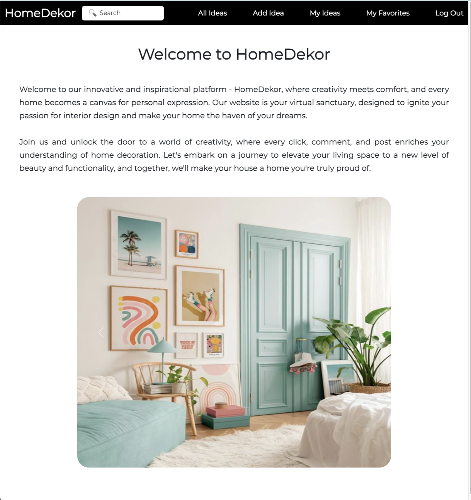
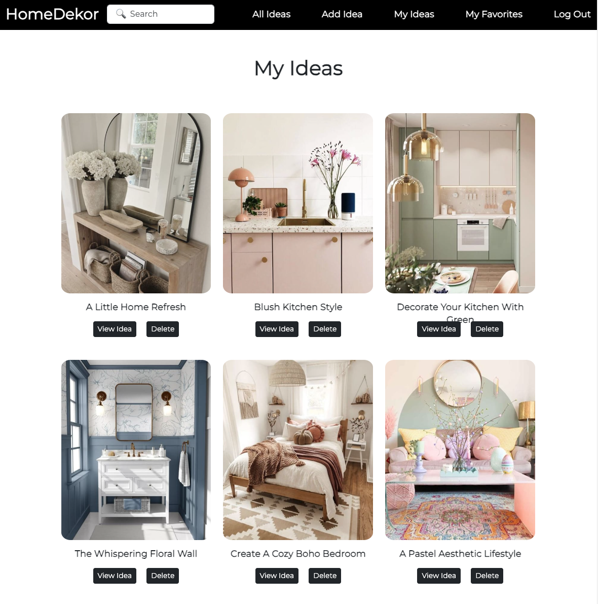
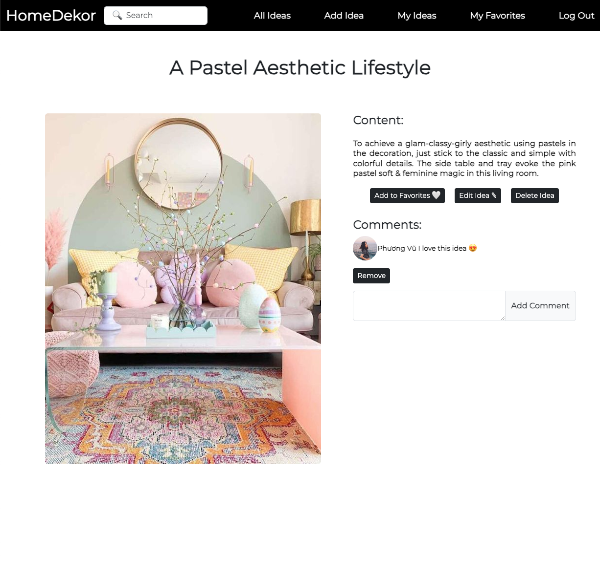
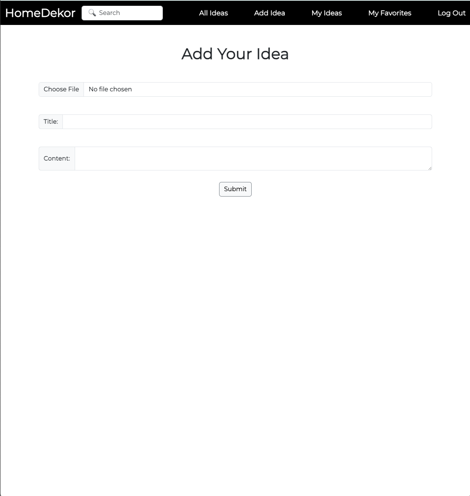

# HomeDekor Web Application
Welcome to Home Decorator, a web application for sharing and exploring home decoration ideas.

## Project Description

Home Decorator is a web application that allows users to discover, save, and share home decoration ideas and inspiration. Users can view and search for posts from other users, and after logging in with their Google account, they gain additional features, including the ability to:
- Add posts to their favorite list.
+ Leave comments on posts and delete their own comments.
- Create, edit, and delete their own home decoration ideas.

Whether you're looking for ideas to transform your living space or want to showcase your creativity, Home Decorator is the perfect platform for home decoration enthusiasts.

## Getting Started
To explore the project, you can visit the following links:

- [Project Planning on Trello](https://trello.com/invite/b/J0EJtsiy/ATTI9575e2b2c951af1510e1b17a079cea204372607E/homedekor) - This Trello board provides insights into the project's development, including tasks, features, and progress tracking.

- [View the Project](https://homedekor-d33828309ba0.herokuapp.com/) - You can access the live deployment of the Home Decorator web application to see it in action.

## Technologies Used
- JavaScript
+ Node.js
- EJS (Embedded JavaScript) for rendering dynamic views
+ CSS for styling
- Mongoose for database interaction
+ MongoDB for data storage
- Bootstrap for responsive design

## Next Steps
The project has a lot of potential for future enhancements. Here are a few ideas for improvements:
- Implement user profiles with more customization options.
+ Implement the "Recommended Posts" feature to keep users engaged by suggesting content that is similar or of interest based on the currently viewed post. 
- Enhance the search and implement filtering functionality for posts.
+ Integrate social sharing feature.
- Enable video uploads for posts.
+ Improve the comment system with notifications and threaded discussions.